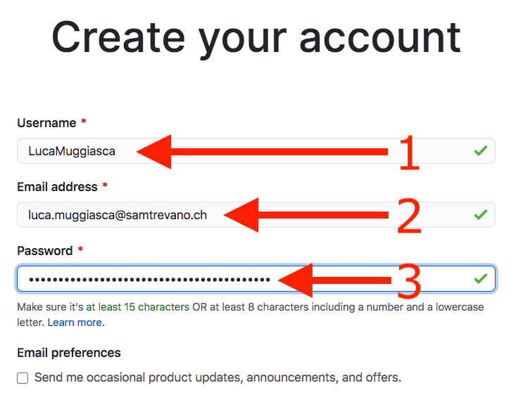
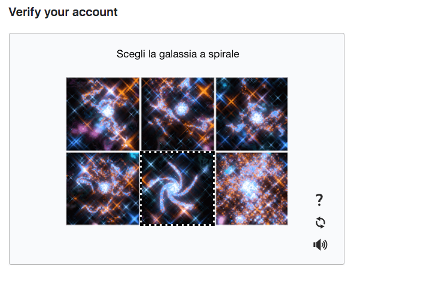
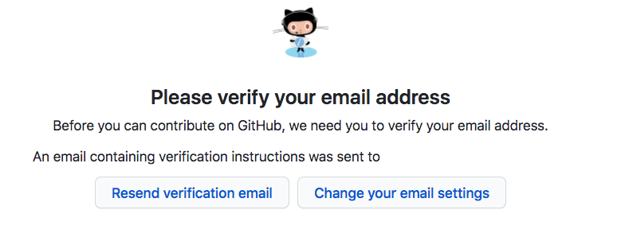
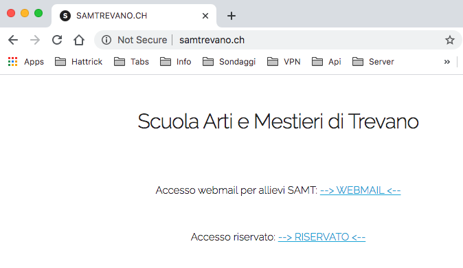
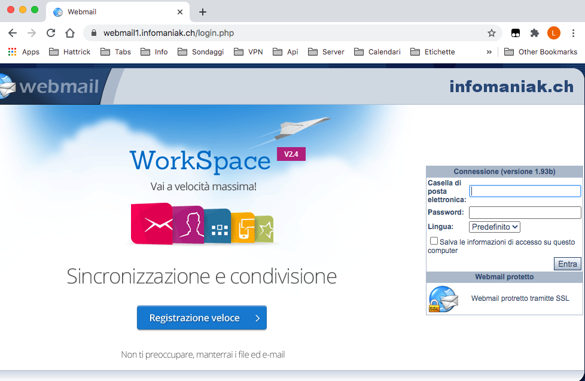

# A01-Registrazione-Github

1. Accedere al sito https://github.com/join

	

2. Creare l'account personale introducendo i propri dati:
	
	- Lo username **deve assolutamente** essere nella forma **```NomeCognome```**
	- L'indirizzo email **deve assolutamente essere quello di scuola** (**```nome.cognome@samtrevano.ch```**)
	- Annotate la password in un posto sicuro, dovrete riutilizzarla per accedere a github

	

3. Rispondere alla domanda per procedere con la creazione

	

4. Completare la registrazione premendo il bottone *Create account*

	

	

5. Accedere alla casella email scolastica

	

	
	
6. Confermare premendo *Verify email address* nella mail indirizzata al vostro indirizzo da parte di GitHub

7. Rispondere alle domande di configurazione del profilo ed il gioco è fatto
